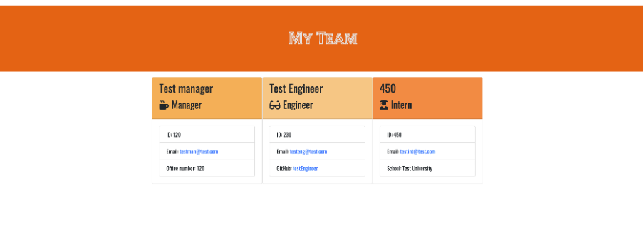
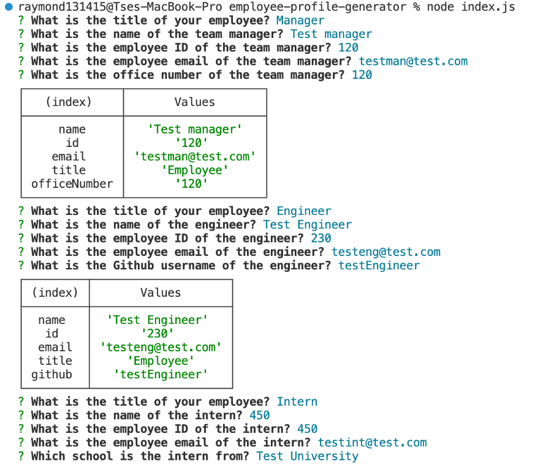
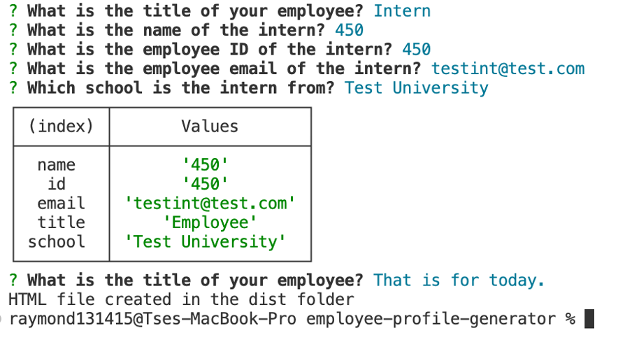

# Employee Profile Generator

  ## Table of Contents
  * [Description](#description)
  * [Installation](#installation)
  * [Usage](#usage)
  * [License](#license)
  * [Contribution](#contribution)
  * [Test](#tests)
  * [Credit](#credit)
  * [Questions](#questions)

  ## Description

  This application will take in information about employees on a software engineering team, then generates an HTML webpage that displays summaries for each person. The employee profile will show as card in the HTML page.

  ## Installation

  Before attempting to use this webapp, the user is required to install the following program: 1. VS code; 2. Node.js. Then, the user can initialise the web app by the following steps: 1. git clone this repo to the local machine; 2. Run "npm install --save inquirer@^8.0.0); 3. Run "node index.js" in the command line; 4. Answer all questions according to your team, and end the app when finish; 5.The team.html will be generated in the output folder.

  ## Usage

  The user can use this web app to generate a webpage that display the team's basic info. For manager, it will show the manager's name, id, email, and the office number. For engineer, it will show the engineer's name, id, email, and the Github ID. For intern, it will show the intern's name, id, email, and the intern's school.

  1. Sample Page
    
  2. Terminal
    
    

  ## License

  
    
  This application is covered by the MIT license.

  ## Contribution

  N/A

  ## Test

  I run the application by the terminal and it successfully generated the HTML page with correct information.

  ## Credit

  To my tutor and TAs, they explained the concept clearly and patiently. 

  ## Questions

  If you have any questions, please contact me, Ray, at:
  
  My GitHub username: ra724619

  My GitHub link: https://github.com/ra724619
  
  My Contact email: ra724619@gmail.com
